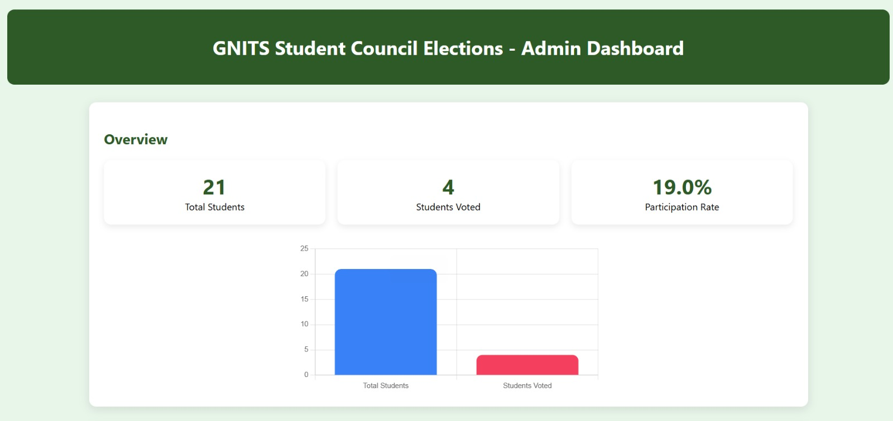

# 📌 Civic Shield: E-Voting System

## 📖 Description

Civic Shield is a secure web-based e-voting system designed for conducting college elections efficiently. It replaces traditional paper-based voting with a fast, transparent, and secure digital platform. The system uses Supabase for backend services and secure database management, ensuring reliable and scalable performance.

---

## 🎯 Objectives

* Digitize and streamline the election process
* Ensure secure and authenticated voting
* Prevent duplicate voting (one user – one vote)
* Provide fast and accurate result generation

---

## 🛠️ Tech Stack

* Frontend: HTML, CSS, JavaScript
* Backend & Database: Supabase (Backend-as-a-Service)
* Security: RSA Encryption, OTP Authentication

---

## ⚙️ Features

* 🔐 Secure login with OTP authentication
* 🗳️ One user – one vote mechanism
* 📊 Real-time vote counting and result generation
* 🧑‍💼 Admin dashboard for election management
* 🔒 Encrypted vote storage for data security

---

## ☁️ Backend Services

* Supabase Authentication
* Supabase Database
* Real-time data handling

---

## ▶️ How to Run

1. Clone the repository
2. Open the project folder
3. Configure Supabase credentials
4. Run the project in a web browser

---

## 📸 Screenshots

### 🔐 Login Page

### 🔑 OTP Verification

### 🗳 Voting Interface

### 📊 Admin Dashboard

### 📈 Results Page

---

## 🔐 Security Features

* RSA Encryption for securing voting data
* OTP-based user authentication
* Secure database storage and access control

---

## 🚀 Future Scope

* Biometric authentication (fingerprint/face recognition)
* Blockchain-based voting system
* Mobile application for easier access

---
